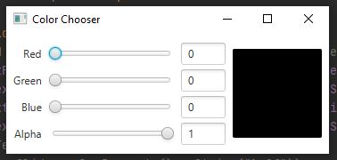
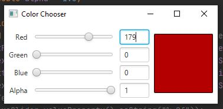
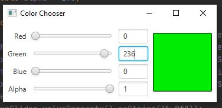
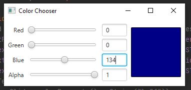

# Color chooser application modification using Javafx and SceneBuilder 
## Author: Jahanzaib Danish
##

# Software needed for this application
## JavaFX SDK ( https://openjfx.io/
## Scene Builder (https://gluonhq.com/products/scene-builder/)
## IntelliJ IDEA ( https://www.jetbrains.com/idea/
##
## In order to setup JavaFX project, follow the instruction on this link: (https://openjfx.io/openjfx/docs/#introduction)
#
## For VM options : --module-path "path-to-openjfx-lib-folder" --add-modules javafx.controls,javafx.fxml
#
In this project, bidirectional bindings have been used between the Sliders and the TextFields such that modifying a TextField’s value updates the corresponding slider.
#

#

#

#

#
